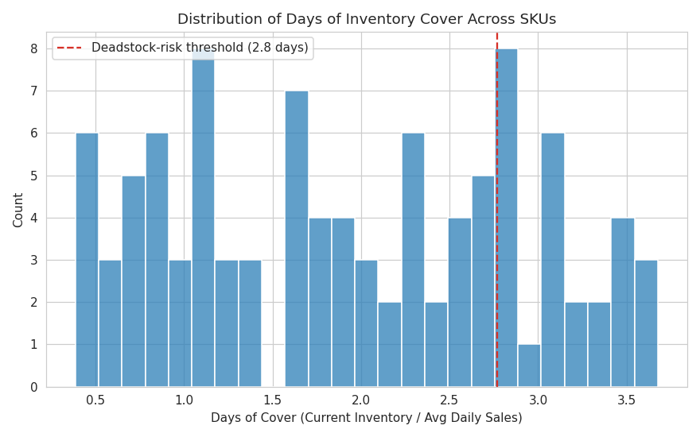
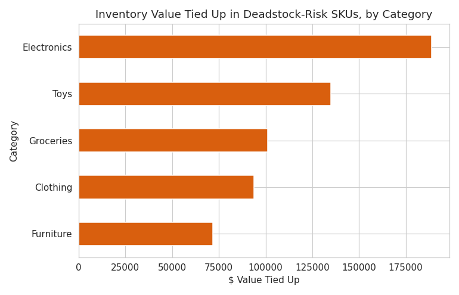
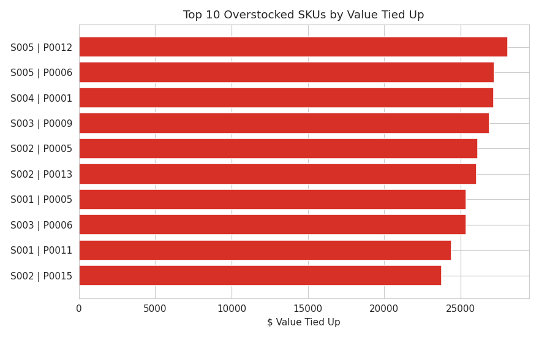
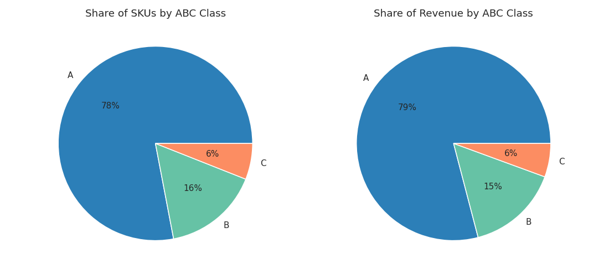
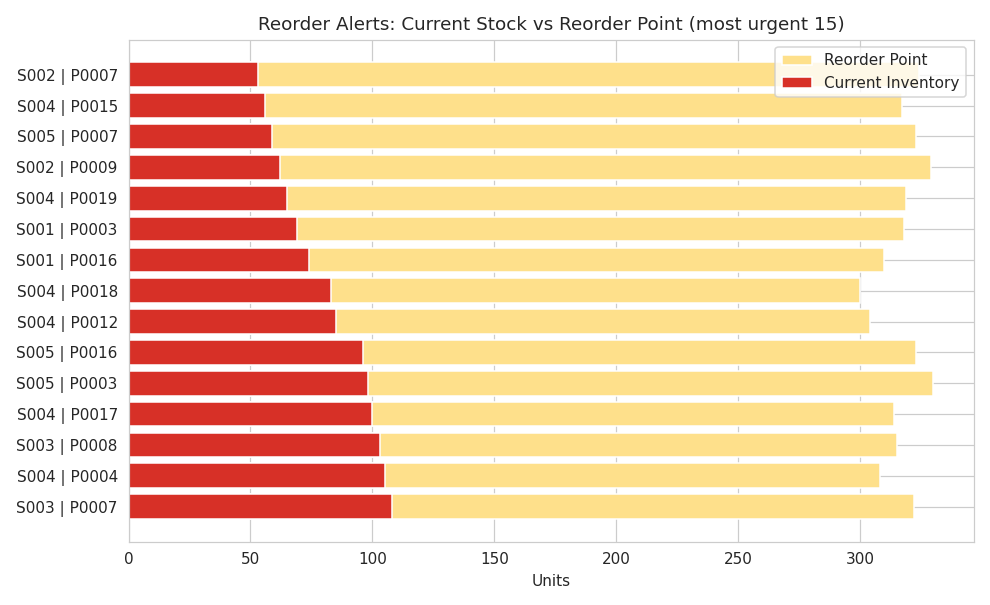

# Deadstock & Inventory Automation Dashboard

## The Review Nobody Should Do By Hand

Somewhere out there is a person scrolling through 100 SKUs trying to eyeball which ones are overstocked and which ones are about to run out. That review should never be a manual job, so this project turns it into a script. Run it once and two files fall out the other end, one telling you what to reorder right now, and one telling you what is quietly tying up cash on the shelf.

Two years of daily inventory data, 2022 to 2024, across 5 stores and 100 SKUs, analyzed to answer the two questions every retailer with physical stock actually cares about. What is overstocked, and what is about to run out.

## Business Questions Answered

* **Overstock & Working Capital:** Which SKUs are overstocked or slow moving, and how much working capital do they tie up.
* **Stockout Risk:** Which SKUs are at risk of stocking out and need reordering right now.
* **Automation Feasibility:** Can this review be automated instead of checked SKU by SKU.

## Project Scope

The analysis covers daily inventory records for 100 SKUs across 5 stores over a full two year window. The scope is deliberately split into two operational outputs rather than one combined dashboard, a reorder list for what needs restocking immediately, and a deadstock report for what is overstocked and tying up cash. The raw file (`retail_store_inventory.csv`) comes from the [Retail Store Inventory Forecasting Dataset](https://www.kaggle.com/datasets/anirudhchauhan/retail-store-inventory-forecasting-dataset) on Kaggle, synthetic data, downloaded separately and placed in `data/raw/` before running `analysis.py`. Derived outputs (`sku_inventory_summary.csv`, `reorder_alerts.csv`, `deadstock_report.csv`) are already included in `data/`.

## Tools & Methodologies

* **Python (Pandas, NumPy):** SKU level aggregation and the automation logic itself.
* **Matplotlib / Seaborn:** inventory health visuals.
* **Inventory formulas:** Days of Cover, Inventory Turnover, ABC Classification, and Reorder Point with statistical safety stock.


## Inventory Health Results & Visuals



*Where every SKU sits on the fast to slow spectrum*



*Dollar value tied up in slow stock, by category*



*The specific SKUs carrying the most tied up value*



*Revenue concentration across the catalog*



*Current stock versus reorder point for the 15 most urgent SKUs*

* **62 of 100 SKUs** are currently below their reorder point and need restocking now.
* **25 SKUs** (the slowest moving quarter by Days of Cover) are flagged as deadstock risk, together holding **$590,409**, about **40% of total inventory value ($1,459,310)**.
* **Electronics carries the largest deadstock value** at roughly **$189K**, followed by **Toys ($134K)** and **Groceries ($101K)**, making it the obvious first candidate for a pricing or promotion push.
* **ABC classification came out flatter than typical retail data**: 78% of SKUs land in Class A, versus the textbook 20% of SKUs drive 80% of revenue pattern. That could reflect genuinely even demand, or it could be a limitation of working with a synthetic practice dataset rather than real transactions with natural demand skew.
* **The automation output**: running `analysis.py` on a fresh daily export produces `reorder_alerts.csv`, every SKU below its reorder point sorted by urgency, and `deadstock_report.csv`, every flagged SKU sorted by dollar value tied up, with no manual filtering of the raw 73K row file required.

## Skills Demonstrated

SKU level data aggregation, inventory health formulas (Days of Cover, Reorder Point, Safety Stock, ABC Classification), Python automation of a recurring operational report, and validating a data key before trusting it rather than after.

## Repository Structure

```
project4_inventory/
│
├── analysis.py
├── sku_inventory_summary.csv
├── reorder_alerts.csv
├── deadstock_report.csv
├── charts/
│   ├── 01_days_of_cover_distribution.png
│   ├── 02_deadstock_value_by_category.png
│   ├── 03_top10_overstocked_skus.png
│   ├── 04_abc_classification.png
│   └── 05_reorder_alerts.png
└── README.md
```

## Key Takeaway

This moves past a static here is what happened report into an operational tool. Point it at a fresh inventory export and it flags what to reorder and what to mark down, with the underlying assumptions, lead time and service level, stated explicitly so they can be tuned to real supplier terms. The Category field check earlier is a small but deliberate example of validating assumptions before reporting on them, not just handing over a clean looking output.

## Future Scope

* Calibrate lead time from actual purchase order history instead of inferring it from stock levels.
* Weight safety stock by holding cost versus stockout cost per category, rather than one universal service level.
* Run this on a schedule, a daily cron job or Power Automate, and email the two output files directly to purchasing.
* Extend the deadstock report with a suggested discount tier based on Days of Cover, tying into the sensitivity analysis from the companion regression project.

## Author

**Rinit Jain**
